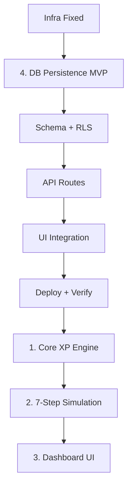

# BTY Arena — Master Workflow

> 이 파일이 현재 프로젝트 단계의 단일 기준이다.

## Current Phase
- [x] 4-1 Schema + RLS
- [x] 4-2 API 연결
- [x] 4-3 UI 연결
- [x] 4-4 Deploy & Verification
- [x] 1 Core XP Engine
- [x] 2 7-Step Simulation
- [x] 2-2(A) Step 1 Start Gate
- [x] 2-2(B) Step 6 Consolidation
- [x] 3-2 Arena UI 컴포넌트 분리
- [x] 3-3 Dashboard 뼈대 구현
- [x] 3-4 Run 완료 마킹 (COMPLETED)
- [x] 9-2 Create arena_profiles table
- [ ] 3 Dashboard UI

---

## 7-Step Simulation (구현 완료)

| Step | 이름 | 구현 위치 |
|------|------|-----------|
| 1 | Start Gate | `ScenarioIntro` → SCENARIO_STARTED |
| 2 | Choosing | `ChoiceList` → CHOICE_CONFIRMED / OTHER_SELECTED |
| 3 | Show Result | `ResultBlock` (XP, system message) |
| 4 | Reflection | `ReflectionBlock` → REFLECTION_SELECTED |
| 5 | Follow-up (선택) | `FollowUpBlock` → FOLLOW_UP_SELECTED |
| 6 | Consolidation | `ConsolidationBlock` |
| 7 | Complete | `CompleteBlock` → run/complete |

이벤트: `/api/arena/event`, Run 완료: `/api/arena/run/complete`. 상태는 localStorage + runId로 복구 가능.

