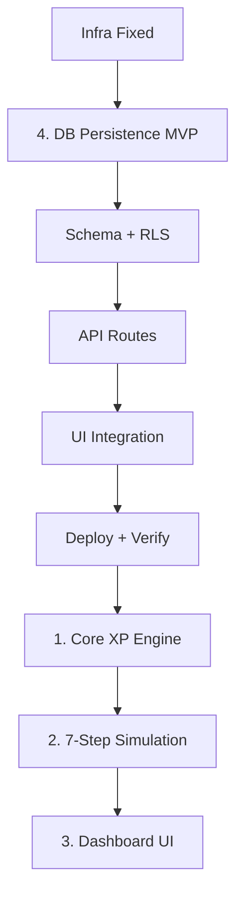

# BTY Arena — Master Workflow

> 이 파일이 현재 프로젝트 단계의 단일 기준이다.

## Current Phase
- [x] 4-1 Schema + RLS
- [x] 4-2 API 연결
- [x] 4-3 UI 연결
- [x] 4-4 Deploy & Verification
- [x] 1 Core XP Engine
- [ ] 2 7-Step Simulation
- [x] 2-2(A) Step 1 Start Gate
- [x] 2-2(B) Step 6 Consolidation
- [x] 3-2 Arena UI 컴포넌트 분리
- [x] 3-3 Dashboard 뼈대 구현
- [ ] 3 Dashboard UI

---

